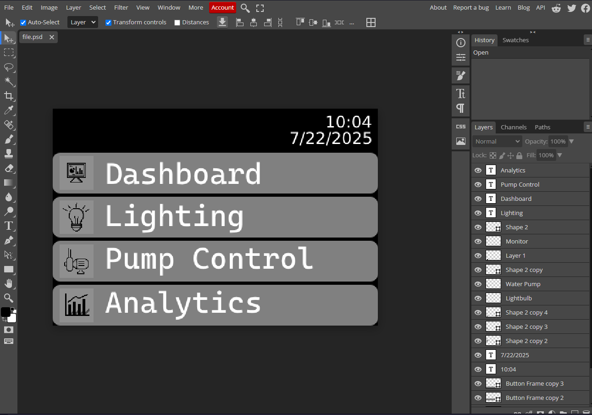

# HydroNano
Smart Hydroponics System

# Features to be added

Sensors: PH, Temperature, Humiditiy, 
Web Application / Webpage Monitor via Zigbee/ WiFi/ LoRa
Actuators 

7/23/2025 Progress on the HMI menu

